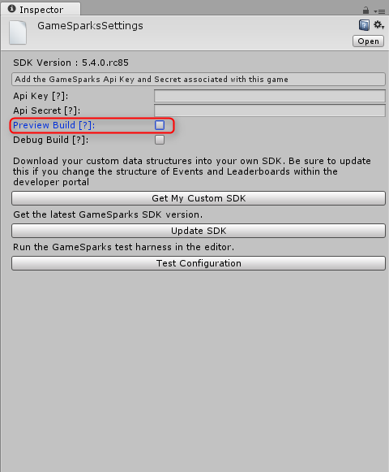
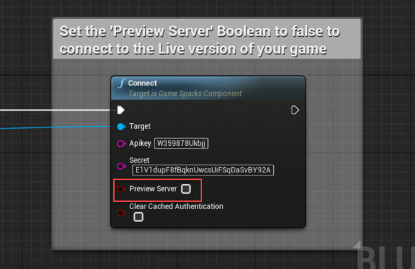

# Going Live Checklist

When you have completed your game configuration, created a Snapshot, and you are ready to publish the Snapshot to Live, follow these steps:

*1.*	Have you previously published a game Snapshot?
* **Yes.**	Go to Step 3.
* **No.**	Go to Step 2.

*2.*	Do you get the Evaluation Signup message?

* **Yes.** This means you can only work in Preview stage on the platform and to proceed you must upgrade your account. The account package you'll want depends on your game's needs:
  * **Enterprise packages.** Please [follow this link](https://www.gamesparks.com/enterprise-packages/) to arrange a call with our Sales team to discuss your needs and ensure you get the best package for you.
  * **Indie & Student Program.** We allow free access to the platform to encourage aspirational but resource-constrained developers - [follow this link](https://www.gamesparks.com/indie-student-programme-faq/) for an FAQ page to see if you are eligible for this program. If you are, you can [apply here](https://www.gamesparks.com/indie-student-programme/).
* **No.**	Go to Step 3.

*3.*	Make sure your Release Candidate Client is pointing to Live?
* How to point to live in [Unity](#Pointing to Live in Unity).
* How to point to live in [Unreal](#Pointing to Live in Unreal).
* How to point to live in [Android](#Pointing to Live in Android).
* How to point to live in ActionScript
* How to point to live in C++
* How to point to live in cocos2d-x
* How to point to live in iOS
* How to point to live in JavaScript
* How to point to live in Marmalade

*4.*	Publish the Snapshot to Live.

## Additional Notes

Please also note the following when you Publish to Live:
* **Mongo Database Collections.** Not all Collections in the Preview stage Mongo database are transferred to the Live stage Mongo database:
  * **Runtime** and **System** Collections *ARE NOT* transferred to the Live stage when a Snapshot is published:
    * They start from empty on first publish because an entirely new Mongo database is created for the game’s Live stage.
    * They are untouched when future Snapshots are published.
  * **Metadata** Collections *ARE* transferred to the Live stage:
    * You can make changes to Meta Collections in Preview stage but any you make *after you’ve published* your Snapshot won't be reflected on Live until the next Snapshot is published.
* **Integrations.** Make sure you have finished setting up your Integrations in the Snapshot that you are getting ready to push to Live. If you create a Snapshot, add an Integration, and then publish the Snapshot without fully setting up your game Integrations, you will get an error on Live. You can do a quick test of your Integrations in the Test Harness before publishing.

## Pointing to Live in Unity

To ensure your Unity client is pointing to Live, in the *GameSparksSettings* window, uncheck *Preview Build*:

## Pointing to Live in Unreal

To ensure your Unreal client is pointing to Live, in the *Connect* function, uncheck *Preview Server*:

## Pointing to Live in Android

To ensure your Android client is pointing to Live, etc., etc...

